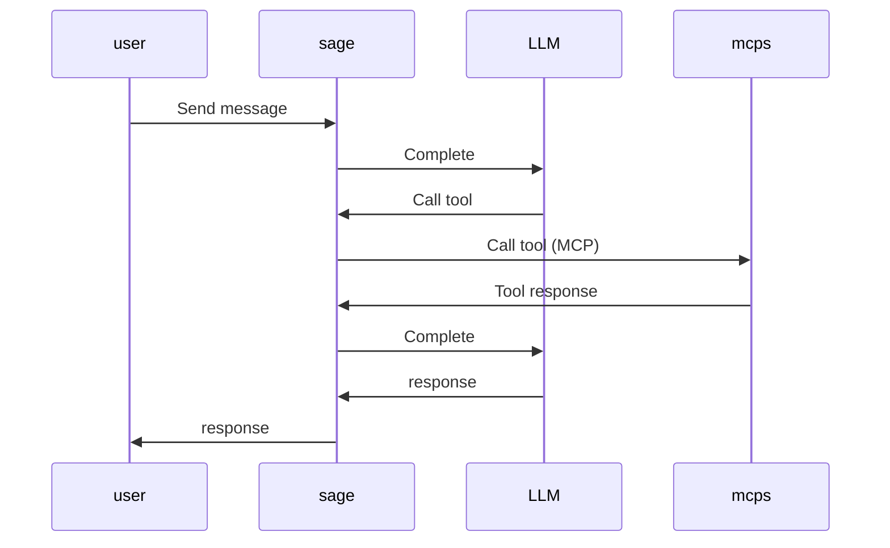
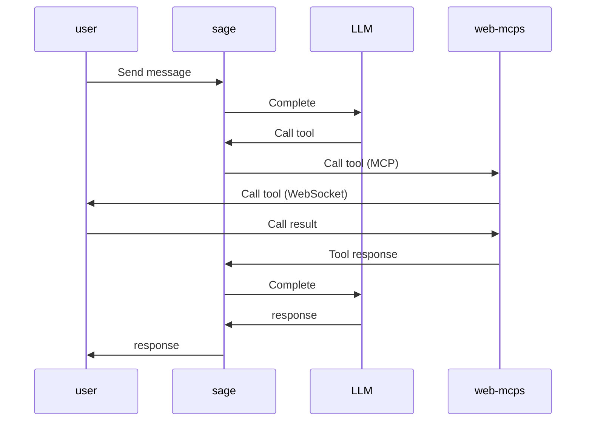

# EGG AI Introduction

Welcome to the AI introduction for the EGG project.
This guide is designed for developers who are new to AI concepts
and want to understand how AI technologies are implemented in our system.

## Overview

This section provides a foundational understanding of key AI technologies
that power modern applications, with a focus on how they relate to the EGG project.

### What is AI?

AI, also known as Artificial Intelligence,
is a technology with human-like problem-solving capabilities.
AI in action appears to simulate human intelligence—it can recognize images,
write poems, and make data-based predictions.[^ai]

[^ai]: <https://aws.amazon.com/what-is/artificial-intelligence/>

### What is deep learning in AI?

Deep learning is an artificial intelligence (AI) method
that teaches computers to process data in a way inspired by the human brain.
Deep learning models can recognize complex pictures, text, sounds,
and other data patterns to produce accurate insights and predictions.
You can use deep learning methods to automate tasks that typically require human intelligence,
such as describing images or transcribing a sound file into text.[^dl]

[^dl]: <https://aws.amazon.com/what-is/deep-learning/>

### Why is deep learning important?

Deep learning technology drives many artificial intelligence applications used in everyday products,
such as the following:

- Chatbots and code generators
- Digital assistants
- Voice-activated television remotes
- Fraud detection
- Automatic facial recognition

It is also a critical component of technologies like self-driving cars, virtual reality, and more.
Businesses use deep learning models to analyze data and make predictions in various applications.

### What are Large Language Models?

Large language models, also known as LLMs,
are very large deep learning models that are pre-trained on vast amounts of data.
The underlying transformer architecture consists of neural networks
with an encoder and a decoder that have self-attention capabilities.
The encoder and decoder work together to extract meaning from text sequences
and understand the relationships between words and phrases.[^llm]

[^llm]: <https://aws.amazon.com/what-is/large-language-model/>


### What is Agentic AI?

Agentic AI is an autonomous AI system that can act independently to achieve pre-determined goals.
Traditional software follows pre-defined rules,
and traditional artificial intelligence also requires prompting and step-by-step guidance.
However, agentic AI is proactive and can perform complex tasks without constant human oversight.
"Agentic" indicates agency — the ability of these systems to act independently,
but in a goal-driven manner.[^aai]

<!-- Adoba is all in AI now -->

[^aai]: <https://aws.amazon.com/what-is/agentic-ai/>

## Prompt Engineering

Prompt engineering is the practice of designing effective inputs (prompts)
to guide large language models (LLMs) in generating desired outputs.
As LLMs become more prevalent in applications, understanding how to craft
effective prompts is essential for maximizing their utility.

<!-- This section is also for frontend to make the frontend MCP better -->

Prompt engineering is a relatively new discipline for developing and optimizing prompts
to efficiently use language models (LMs) for a wide variety of applications and research topics.
Prompt engineering skills help to
better understand the capabilities and limitations of large language models (LLMs).[^pe]

[^pe]: <https://www.promptingguide.ai/introduction/tips>

### Zero-shot

Zero-shot prompting means that the prompt used to interact
with the model won't contain examples or demonstrations.
The zero-shot prompt directly instructs the model to perform a task
without any additional examples to steer it.

Prompt:

> Classify the text into neutral, negative or positive.
> Text: I think the vacation is okay.
> Sentiment:

Output:

> Neutral

### Few-shot

Few-shot prompting can be used as a technique to enable in-context learning
where we provide demonstrations in the prompt to steer the model to better performance.

Prompt:

> A "whatpu" is a small, furry animal native to Tanzania.
> An example of a sentence that uses the word whatpu is:
> We were traveling in Africa and we saw these very cute whatpus.
>
> To do a "farduddle" means to jump up and down really fast.
> An example of a sentence that uses the word farduddle is:

Output:

> When we won the game, we all started to farduddle in celebration.

### Chain-of-Thought (CoT)

Introduced in [Wei et al. (2022)](https://arxiv.org/abs/2201.11903),
chain-of-thought (CoT) prompting enables complex reasoning capabilities
through intermediate reasoning steps.
You can combine it with few-shot prompting to get better results on more complex tasks
that require reasoning before responding.[^cot]

Prompt:

> The odd numbers in this group add up to an even number: 4, 8, 9, 15, 12, 2, 1.
>
> A: Adding all the odd numbers (9, 15, 1) gives 25. The answer is False.
>
> The odd numbers in this group add up to an even number: 17, 10, 19, 4, 8, 12, 24.
>
> A: Adding all the odd numbers (17, 19) gives 36. The answer is True.
>
> The odd numbers in this group add up to an even number: 16, 11, 14, 4, 8, 13, 24.
>
> A: Adding all the odd numbers (11, 13) gives 24. The answer is True.
>
> The odd numbers in this group add up to an even number: 17, 9, 10, 12, 13, 4, 2.
>
> A: Adding all the odd numbers (17, 9, 13) gives 39. The answer is False.
>
> The odd numbers in this group add up to an even number: 15, 32, 5, 13, 82, 7, 1.
>
> A:

Output:

> Adding all the odd numbers (15, 5, 13, 7, 1) gives 41. The answer is False.

For details, please see
[DeepSeek-R1 笔记](https://zhuanlan.zhihu.com/p/21664432898).

[^cot]: <https://www.promptingguide.ai/techniques/cot>

### Retrieval Augmented Generation (RAG)

General-purpose language models can be fine-tuned to achieve several common tasks
such as sentiment analysis and named entity recognition.
These tasks generally don't require additional background knowledge.

For more complex and knowledge-intensive tasks,
it's possible to build a language model-based system
that accesses external knowledge sources to complete tasks.
This enables more factual consistency, improves reliability of the generated responses,
and helps to mitigate the problem of "hallucination".

The following diagram shows the conceptual flow of using RAG with LLMs.[^rag]


[^rag]: <https://aws.amazon.com/what-is/retrieval-augmented-generation/>

### ReAct

A ReAct agent is an AI agent that uses the “reasoning and acting” (ReAct) framework
to combine chain of thought (CoT) reasoning with external tool use.
The ReAct framework enhances the ability of a large language model (LLM)
to handle complex tasks and decision-making in agentic workflows.[^react]


[^react]: <https://www.ibm.com/think/topics/react-agent>

## MCP

While prompt engineering enables effective communication with LLMs,
the Model Context Protocol (MCP) provides a standardized way for applications
to provide context and tools to these models, enabling more sophisticated interactions.

The Model Context Protocol ([MCP]) is an open standard
that defines how applications can provide context and tools to large language models (LLMs).
As AI systems become more sophisticated, MCP has gained significant adoption across the industry,
with major tech companies implementing it in their AI solutions.

Examples of MCP implementations include:

1. [MCP Toolbox for Databases](https://github.com/googleapis/genai-toolbox)
2. [Microsoft Model Context Protocol (MCP) Servers](https://github.com/microsoft/mcp)

MCP is particularly valuable in scenarios
where LLMs need to interact with external tools and systems,
such as retrieving real-time data, accessing databases,
or controlling user interface elements.
The protocol uses
[JSON-RPC](https://github.com/modelcontextprotocol/go-sdk/blob/main/jsonrpc/jsonrpc.go)
as its underlying communication mechanism, which is built on `HTTP` and `JSON` formats.

### Backend MCP

The backend MCP implementation enables our system to provide tools and context to the LLM,
allowing it to perform actions like fetching real-time data.
The following sequence diagram illustrates how the `aggs` server processes
user requests through the MCP protocol:



As an example, consider our weather tool implementation:

```go
func (s *Weather) Tools() []server.ServerTool {
  // Define the tool specification that will be available to the LLM
  return []server.ServerTool{
    {
      Tool: mcp.NewTool("get_current_weather",
        mcp.WithDescription("Get current weather"),
        mcp.WithString("city", mcp.Required(), mcp.Description("City name in English")),
      ),
      // Link the tool specification to its implementation
      Handler: s.GetCurrent,
    },
  }
}

func (s *Weather) GetCurrent(ctx context.Context, req mcp.CallToolRequest,
) (*mcp.CallToolResult, error) {
  // Extract the required city parameter from the tool call
  city, err := req.RequireString("city")
  if err != nil {
    return mcp.NewToolResultErrorFromErr("err", err), nil
  }
  // Call the external weather API to get current weather data
  resp, err := s.c.GetCurrent(ctx, weatherapi.WithCity(city))
  if err != nil {
    return mcp.NewToolResultErrorFromErr("err", err), nil
  }
  // Format the weather data into a human-readable string
  c := resp.Current
  t := fmt.Sprintf(
    "Weather in %s, %s: %s, Temp: %.1f°C (Feels like %.1f°C), Wind: %s at %.1f kph",
    resp.Location.Region, resp.Location.Name,
    c.Condition.Text, c.TempC, c.FeelslikeC,
    c.WindDir, c.WindKPH,
  )
  // Return the formatted weather information as the tool result
  return mcp.NewToolResultText(t), nil
}
```

When implementing MCP tools, it's important to properly handle errors.
For tool-specific errors, we should use `mcp.NewToolResultErrorFromErr`
rather than returning a generic error.
This allows the Agent to understand what went wrong and potentially recover from the error.

**TODO**: Implement a wrapper to simplify error handling in MCP tools.

In essence, implementing an MCP tool is similar to
creating an RPC method that generates text based on the provided arguments.

### Frontend MCP

While backend MCP tools are ideal for accessing external systems and APIs,
frontend MCP tools are particularly useful for creating interactive user experiences
where the LLM needs to control UI elements in real-time.

For UI actions, we use the MCP protocol to create a clean architectural separation.
All UI actions are registered with an MCP server that is deployed alongside our backend services.
The web page communicates with the UI MCP server using the `WebSocket` protocol,
which enables real-time, bidirectional communication for implementing complex interactive logic.

The following sequence diagram shows the flow of interactions in our frontend MCP implementation:



In this architecture, business logic is handled in the frontend components.
Each tool must be registered on the server and handled in the frontend code.

Example implementation:

Server registration:

```ts
export function registerTools(s: McpServer) {
  registerTool(s, "changeBackground", {
    title: "切换背景色",
    description: "切换页面背景颜色",
    inputSchema: {
      color: z.string().describe("背景颜色，支持颜色名称或十六进制值"),
    },
  });
}
```

Client handling:

```ts
ws.onmessage = (event) => {
  const msg: Message = JSON.parse(event.data.toString());
  switch (msg.type) {
    case "initialize":
      sessionId = msg.data.sessionId;
      // This session id should be added to the http header Mcp-Session-Id
      console.log("Got session ID:", sessionId);
      break;
    case "toolCalls":
      for (const call of msg.data) {
        // Process each tool call
        console.log("Got tool call:", call);
        const result: Message = {
          type: "toolCallsResult",
          data: [{ id: call.id, ok: true }],
        };
        ws.send(JSON.stringify(result));
      }
      break;
    default:
      console.log("Unknown message:", msg);
      break;
  }
};
```

Example tool call format:

```js
{
  id: '7',
  type: 'function',
  function: { name: 'changeBackground', args: { color: 'red' } }
}
```

## Postscript

Let's ship for the AI era.

[mcp]: https://modelcontextprotocol.io/introduction
