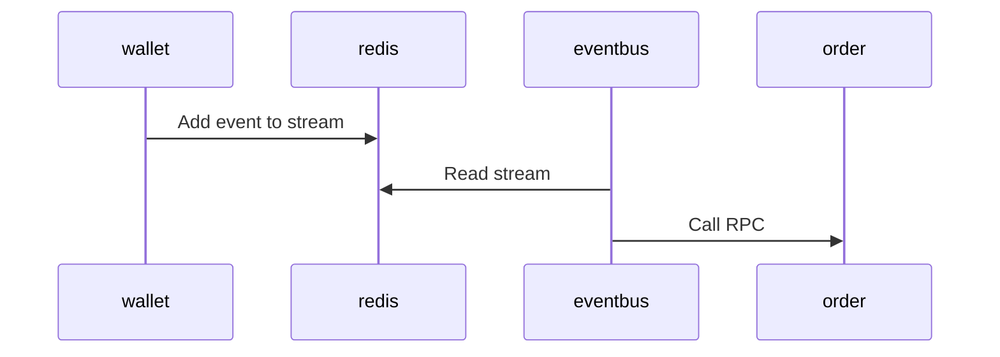

---
authors:
  - ionling
categories:
  - Backend
  - Event-Driven
date: 2023-11-10
---

# Introduction to the eventbus service

The eventbus service is the Event-Driven Architecture (EDA) implementation in adoba services.

## Introduction

Here, Redis Stream data structure serves as the message queue.
In other services, events are added to the stream.
The eventbus service then consumes these messages
and utilizes Remote Procedure Call (RPC) for communication with other services.

See:

In the past, the prevailing practice was to develop a sidecar queue service,
like `strandq` or `studioq`, for each individual service.
However, this approach introduced redundancy and demanded repetitive effort for each service,
making it both time-consuming and resource-intensive.
Consequently, a more efficient strategy emerged:
consolidating the handling of all events within the eventbus service,
eliminating the need for separate management.
This consolidation encapsulates the core concept of an "eventbus."

When interacting with an external message system, such as Aliyun MNS,
having a dedicated standalone queue service (like `strandq`) proves advantageous.
This design choice preserves the conciseness of the eventbus service
and aligns with the single responsibility principle, ensuring clear and modular responsibilities.

## Why Event-Driven

Let's talk about the drawbacks first.
The big one is that event-driven architecture makes the system more complex,
and we have to spend more time developing a new feature.

But advantages are more!

Advantages of Event-Driven Architecture:

1. **Loose Coupling**:
   EDA promotes loose coupling between different components of a system.
   Components communicate through events, and they don't need to be aware of each other's existence.
   This characteristic makes it easier to develop, test,
   and maintain individual components independently.

2. **Enhanced Fault Tolerance**:
   Since components in an event-driven system are decoupled,
   the failure of one component doesn't necessarily lead to the failure of others.
   Components can continue processing events
   even if some other parts of the system are temporarily unavailable.
   This enhanced fault tolerance ensures system stability during partial failures.

3. **Event Replay**:
   The advantage of replay is the ability to reprocess or reevaluate past events.
   This is useful for debugging, testing, correcting data,
   and recovering from errors or failures in a system.

4. **Asynchronous Communication**:
   Events in an event-driven system are often communicated asynchronously.
   This enables systems to handle high loads and peak traffic more effectively.
   Components can publish events without waiting for subscribers to process them immediately.
   Asynchronous communication contributes to the scalability and responsiveness of the system.

5. **Improved Inter-Team Collaboration**:
   When two services are controlled by different teams,
   EDA becomes an optimal choice, minimizing conflicts and arguments between teams.
   The loosely coupled nature of EDA allows teams to work more independently
   without directly impacting each other,
   fostering smoother collaboration and reducing potential friction.

## Design Patterns

Several design patterns align with Event-Driven Architecture,
further enhancing its suitability for complex systems. Notable patterns include:

- [CQRS pattern](https://learn.microsoft.com/en-us/azure/architecture/patterns/cqrs)
- [Event Sourcing pattern](https://learn.microsoft.com/en-us/azure/architecture/patterns/event-sourcing)
